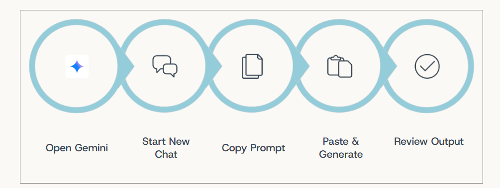
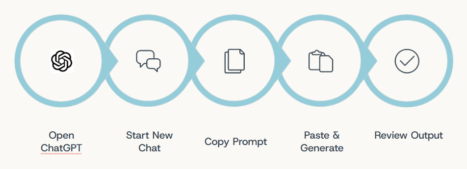
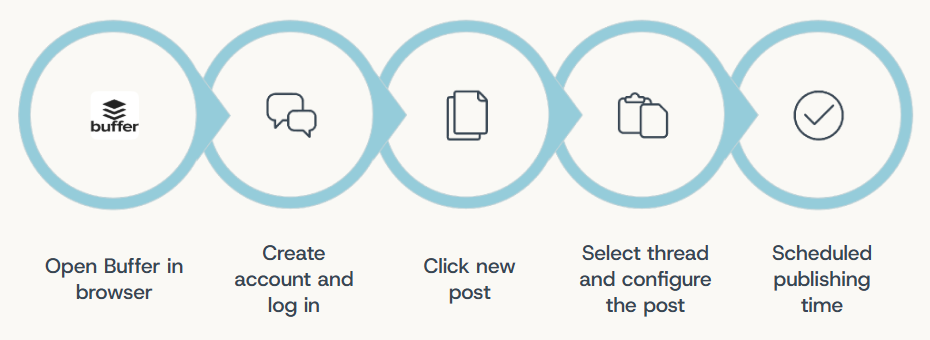

# Automated Social Media Content Engine

## Introduction
“Any sufficiently advanced technology is indistinguishable from magic.” This iconic law by Arthur C. Clarke captures the awe-inspiring shift from tedious manual labor to the power of artificial intelligence. A traditional digital workflow often feels like an exhausting treadmill, demanding high investments of time and effort just to write copy, edit visuals, and schedule posts manually. But a truly optimized AI system does more than just maintain consistency in the face of flat engagement. It operates almost like magic in the background, breaking the cycle of late Sunday nights and protecting our work-life balance. Strategic AI changes our entire approach, empowering side-hustle affiliate marketers to step off the treadmill and produce smarter, faster, and more relevant content.

## The Challenges
Operating as a solo creator alongside a full-time job exposes major bottlenecks when relying on manual execution alone:   
 - Ideation Burnout: Developing fresh angles every week leads to creative fatigue, making it difficult to generate relevant, engaging captions consistently.   
 - Time-Consuming Production: Manually writing copy and editing visual assets consumes hours of focused effort, drastically reducing overall productivity.   
 - Sacrificed Work-Life Balance: Setting up and queuing posts manually forces creators into late Sunday night shifts just to maintain a weekly cadence.   
 - Fragmented Visual Identity: Assembling graphics by hand across disparate sessions creates an inconsistent design aesthetic that weakens brand authority.   
 - Stagnant Reach: Despite high effort and consistent manual posting, audience engagement often remains flat. 

## The Solution: A Strategic 4-Step AI Workflow
To overcome these roadblocks, this project deploys a three-tool tech stack designed for speed, cohesion, and automation: 
- Gemini for long-term monthly planning
- ChatGPT for humanlike copywriting and high-fidelity image rendering
- Buffer for hands-free publishing

1. **Monthly Planning (Gemini)**

Gemini handles high-level content architecture, transforming an empty calendar into a structured 30-day posting roadmap.

 - **Workflow:**  Open Gemini, launch a new chat, execute the prompt, and review the calendar breakdown
 - **Prompt Template:** "I am an affiliate marketer promoting gaming products to PC gamers. Create a 30-day social media content calendar with four affiliate promotional posts and three educational posts per week. Use a friendly, trustworthy, and professional tone. Include the post topic, hook, caption angle, suggested visual, call to action, and whether an affiliate disclosure is required."

2. **Conversational Copywriting (ChatGPT)**

ChatGPT converts the calendar angles into natural, conversion-driven copy tailored for modern platforms like Threads.

 - **Workflow:**  Paste the post angle into ChatGPT, review variations, and refine tone.
 - **Prompt Template:** "Write five Threads captions for an affiliate post promoting an ergonomic office chair. The audience is busy office professionals aged 25–40 who play games as a hobby. Use a helpful, authentic, and professional tone. Avoid exaggerated claims, include a clear call to action, and add an affiliate disclosure such as: ‘This post contains affiliate links, I may earn a commission at no extra cost to you.’"

3. **Commercial Visual Generation (ChatGPT)**

ChatGPT generates photorealistic, commercial-grade product visuals without requiring studio equipment or complex design software.

 - **Workflow:**  Feed detailed composition, lighting, and product specifications into the image generator to preserve key design details.
 - **Prompt Template:** "Create a highly realistic cinematic product photograph using the exact black mesh ergonomic office chair from the reference image. Preserve its original design, proportions, headrest, lumbar supports, armrests, mesh texture, five-star base, and caster wheels. Place the chair in a modern, tasteful office setting with a dark wood desk in the foreground and a computer monitor positioned on the desk in front of the chair. The monitor should be turned slightly toward the chair and display a subtle dark, neutral screen with no visible logos or text. Use warm directional light from one side, soft window light in the background, realistic shadows, subtle depth of field, premium office atmosphere, natural materials, clean composition, and cinematic color grading. Keep the chair as the main focal point, centered and fully visible behind the desk. Photorealistic, high detail, realistic mesh and metal textures, professional commercial furniture photography, 35mm lens, eye-level camera, dramatic but natural lighting."

4. **Automated Publishing (Buffer)**

Buffer decouples content distribution from personal time, running the queue autonomously.

 - **Workflow:**  Access Buffer via browser, log in, create a new post, select the Threads channel, paste the copy and visual asset, and set the automated publish time.

